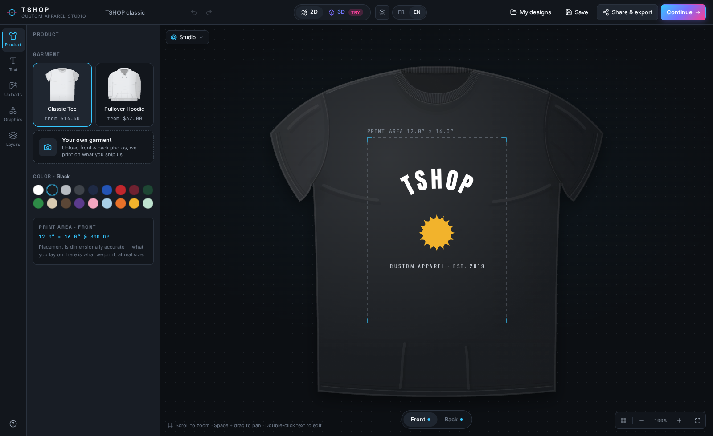
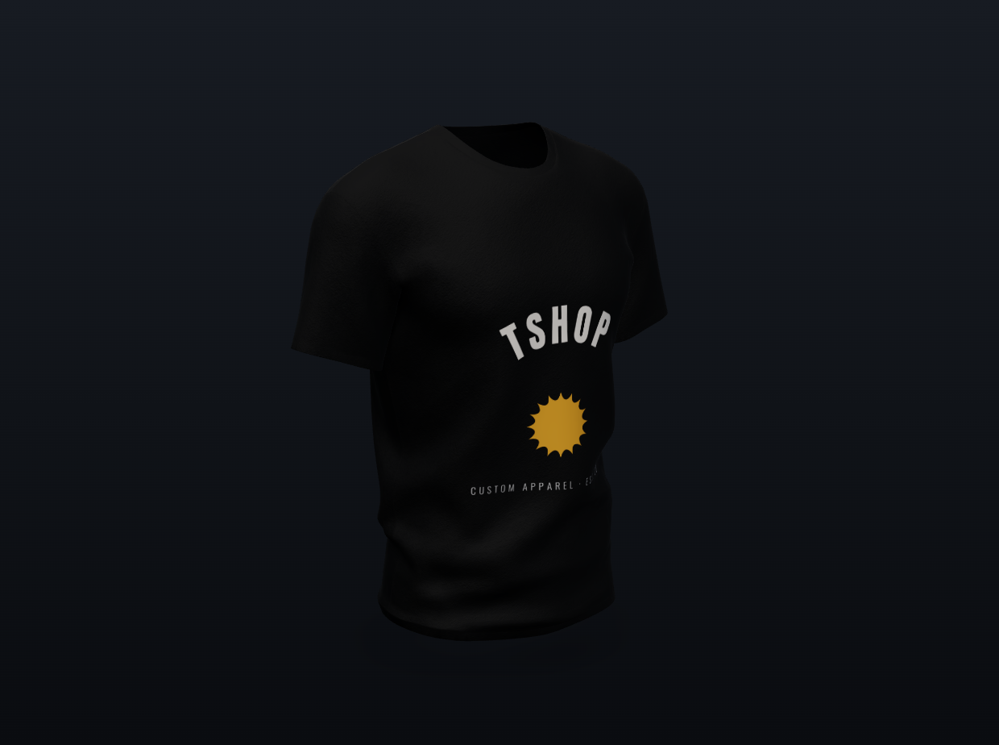
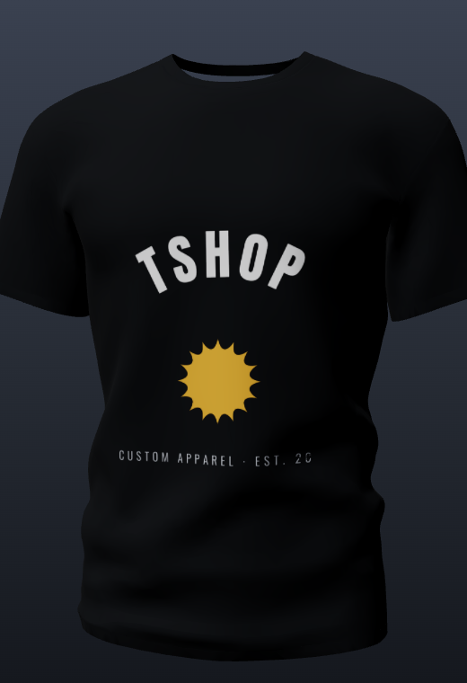
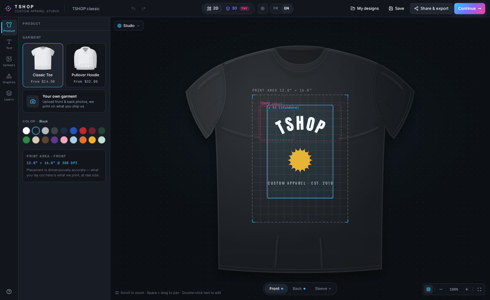
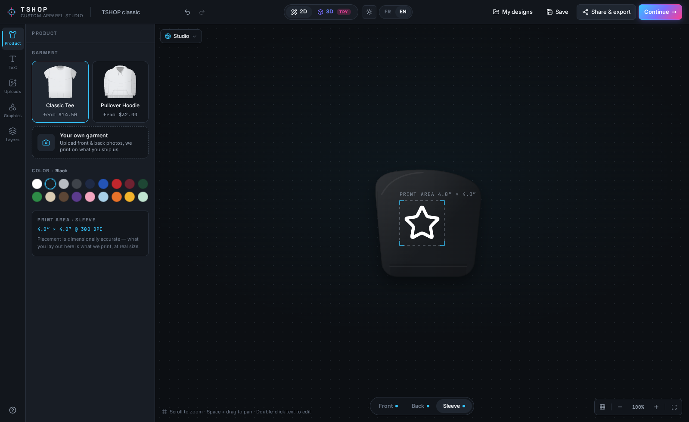
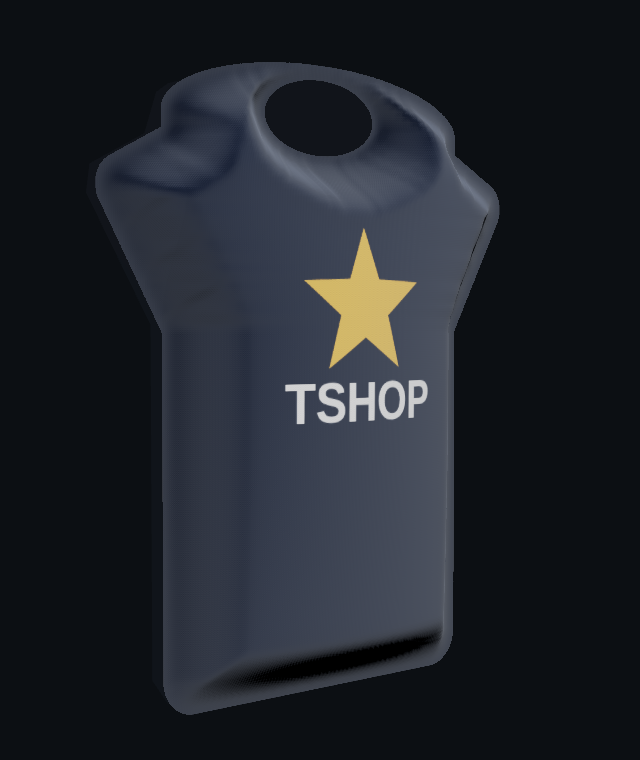
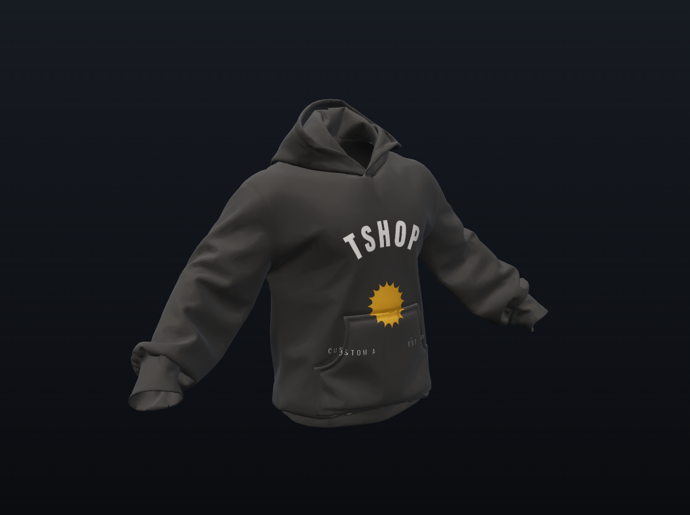
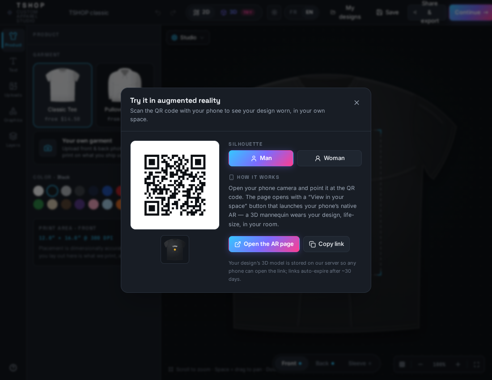
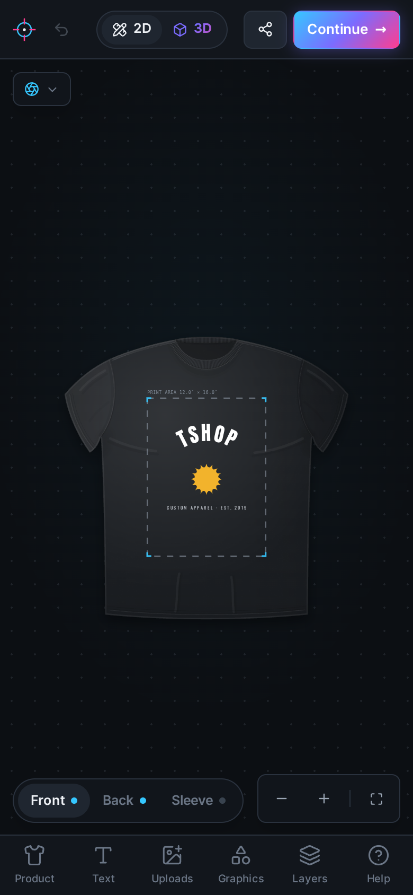
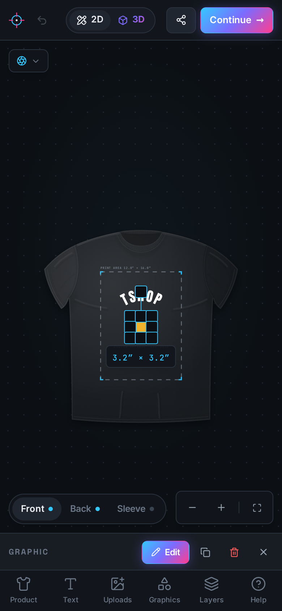

# Tshop Studio

A one-page custom apparel design studio for **Tshop**: customers design tees,
hoodies, or their own shipped-in garments; preview the result in 2D, true 3D,
and **augmented reality**; and hand over print-ready artwork with a quote
request. It works fully on phones and stays exact to real inches from the screen
to the press.

| 2D editor | 3D preview | AR try-on |
| --- | --- | --- |
|  |  |  |

The studio is a static browser app: designs, uploads, and AI background removal
all run and stay in the visitor's browser. The **only** server-side piece is a
tiny Cloudflare Worker + R2 bucket that briefly hosts a design's 3D model so a
scanned QR opens it in AR on any phone (see [Augmented reality](#augmented-reality-try-on)).

## Features

**Design tool**
- Multi-layer editor: text, uploaded images, and a ~130-piece graphics library
- 12 print fonts, arched/valley curved text, outlines, letter-spacing
- Drag / resize / rotate with magenta smart guides and snapping, zoom & pan
  (mouse **and** touch pinch-zoom), undo/redo, keyboard shortcuts (`?` shows the
  cheatsheet)
- **Everything is measured in real inches.** The editor, the 3D preview, the AR
  view, and the exported print files share one geometry, so a 3″ graphic is 3″
  on the press. Print areas match industry sizes (tee 12×16″, hoodie 12×12″
  front / 12×14″ back, sleeve 4×4″)

**Placement guides**: put artwork exactly where it belongs
- Toggle a **1-inch grid** and **named print areas** (A4, chest, left-chest,
  upper/centre back) drawn right on the garment; A4 is highlighted as the
  affordable standard
- Every area (plus A5 and the full print area) is a one-tap **"Place in area"**
  chip that centres and fits the selected layer; artwork also **snaps to zone
  edges & centres** as you drag



**Garments & sides**
- Classic tee + pullover hoodie in 18 colors, with **front, back and sleeve**
  print sides
- **Bring-your-own garment**: customers photograph the garment they'll ship in,
  place the print area on the photo, and design on it (in 2D, 3D, and AR)

| Sleeve print side | Placement chips |
| --- | --- |
|  |  |

**2D / 3D preview**
- Loads in fast 2D mode by default; the highlighted toggle switches to a 3D
  studio: real garment meshes with a **cloth sheen**, canvas-texture decals of
  the live design, procedural studio lighting + soft contact shadows, orbit
  controls, camera snaps, turntable, and six environment scenes
- Custom garments render as a **real, volumetric garment**: the uploaded photo
  is inflated into a torso-centred body with a **seamed** cross-section (front
  and back panels meet at a garment seam, not a sealed pillow), **chest-full**
  depth that tapers over the shoulders and hem, per-row medial thickness (deep
  body, shallow sleeves), baked ambient occlusion, a woven-cloth normal grain,
  and a hollow neck, so it reads as a garment with volume, not a balloon

| Custom garment (3D) | Hoodie (3D) |
| --- | --- |
|  |  |

**Augmented reality try-on**
- **"View in AR"** (in **both** the 2D editor and the 3D preview) bakes the
  design onto a **realistic, life-size figure wearing the garment**: a neutral
  matte-gray display mannequin, **male or female** (switch in the modal), the
  garment **recoloured to your chosen colour** and the print placed on the chest,
  back and sleeves at the **same positions as the 2D/3D editor**. Ship-your-own
  **custom garments are WORN on the same male/female avatar**: the customer's
  ACTUAL uploaded garment (photo + design) is draped onto the body as a
  surface-conforming layer over a neutral undershirt, so it reads as a person
  wearing exactly that garment (not a stand-in tee, and no longer a bare
  floating shell). It exports to
  **glTF (GLB) + USDZ**, uploads to the blob store, and shows a **QR of a short
  link** (each gender bakes its own model, so its QR/link is distinct)
- Because the model lives server-side, the QR is small (so it scans reliably) and
  works **cross-device**: any phone
- Scanning opens a lightweight viewer page with a spinning 3D preview and a
  **"View in your space"** button that launches the phone's **native AR**
  (Scene Viewer on Android, Quick Look on iOS), planting the life-size figure (or
  your custom garment) on your real floor, with the OS's own screenshot & share
- The exported GLB is engineered to pass Android **Scene Viewer's** strict import
  checks (single opaque textured mesh, alpha-cutout prints so there are **0
  transparent materials**, power-of-two textures, correct inches→metres scale).
  The export test (`scripts/ar-verify.mjs`) enforces all of it plus the Khronos
  glTF-Validator on every build



**Works on your phone**
- A full Canva-style mobile UI: full-bleed canvas, a bottom tool-nav, slide-up
  tool sheets, safe-area (notch / home-indicator) handling, and touch-sized
  controls
- Tapping a layer shows a slim **selection bar** (edit · duplicate · delete) that
  never covers the artwork (so you can drag it freely) and **"Edit"** expands
  the full properties sheet only when you want it

| Mobile canvas | Editing on mobile |
| --- | --- |
|  |  |

**AI background removal**
- One click cuts the subject out of any upload (U²-Net running on-device via
  onnxruntime-web; ~4.4 MB model fetched once, zero uploads)

**Save, share, order**
- Autosave + named designs (IndexedDB), design-file export/import with embedded
  images, share links (design compressed into the URL) for text/graphic designs
- Mockup PNGs and **300-DPI transparent print files** per side, with
  low-resolution warnings
- Quote request flow with size grid, quantity discounts, and email handoff.
  Pricing is flat per side by default, with **optional area-aware tiers** wired
  in (A4-and-under is the standard price; larger prints step up). See
  [Configuration](#configuration)

## Stack

Vite 8 (multi-page: studio + AR viewer) · React 19 · TypeScript (strict) ·
Tailwind CSS v4 · Konva (2D editor engine) · three.js + react-three-fiber + drei
(3D) · three GLTFExporter / USDZExporter / GLTFLoader (AR models) · zustand +
zundo (state + undo) · onnxruntime-web + U²-Net (background removal) · qrcode ·
idb-keyval · lz-string · Cloudflare Worker + R2 (AR model store)

## Local development

```sh
npm install
npm run dev        # BOTH: wrangler dev on :8787 (API) + vite on :5173 (studio)
npm run dev:web    # vite only, no /api/*: the Falk&Ross catalogue and AR
                   # upload/QR flows are down, everything else works
npm run dev:api    # wrangler dev only (the Worker, on :8787)
npm run build      # typecheck (app + worker) + production build into dist/
npm run preview    # serve the production build locally
```

`npm run dev` runs the **two processes the app actually needs**: the Cloudflare
Worker (Falk&Ross catalogue at `/api/fr/*`, AR store at `/api/ar`) and the Vite
dev server, which proxies `/api` to it. Credentials for the catalogue go in
`.dev.vars` (see below). If the catalogue ever reports the backend as down,
that message now tells you exactly this. `TSHOP_NO_WORKER=1 npm run dev` skips
the Worker on purpose.

Dev-only visual harnesses (not part of the build): `/dev/garments.html`,
`/dev/three.html`, `/dev/inflate.html`, `/dev/text.html`, `/dev/bgremove.html`.

Headless checks (Playwright): the full flow `node scripts/e2e-verify.mjs <url>`,
plus focused ones for the WebGL/AR features that OS screenshots can't capture:
`node scripts/inflate-verify.mjs` (3D volume), `node scripts/ar-verify.mjs`
(GLB/USDZ export), and `node scripts/ar-worker-verify.mjs` (the Worker + R2
round-trip via `wrangler dev`). Regenerate the README screenshots with
`node scripts/readme-shots.mjs`.

**`npm run verify:render` is the only gate that looks at a rendered frame.** Every
other 3D harness measures geometry, and that is exactly where this module's defects
were not: it asserts the properties a garment PHOTOGRAPH has, on the real bundle in
a real browser, over all six scenes a customer can flip to, on both catalogue meshes
and on an uploaded garment (a different renderer entirely). Is the garment cropped, is
it centred, does it fill the pane, does it throw a shadow onto anything, can its outline
be told from the backdrop, does its shadow side keep detail, does white cloth read white
and neutral, and is the same capture repeatable. It classifies pixels by capturing the stage in three layers
(garment alone, empty stage, both) rather than by guessing what cloth looks like,
and it composites the CSS backdrop through an SVG foreignObject because the frame a
customer sees exists in no single buffer. It runs under `prefers-reduced-motion`,
without which no two captures are the same pose. It is slow (a few minutes per case
under software GL) and stays out of CI, like the other browser harnesses.

`npm run verify:mockups` renders the garment set a product page needs, from the studio's
own 3D preview: front, three-quarter, back and a **detail** framing that moves the camera
in until the print area fills the pane, each shot both printed and bare. It is a render
harness, not a publishing step: **nothing reads its output yet.** The image the cart, the
proof and the order e-mails actually show is still the flat `renderMockup` composite the
studio uploads to R2 at checkout, and joining the two is a project rather than a wiring
change (a product-page image is per garment and can be rendered in advance; a proof image
is per design and could only be rendered in the customer's browser, where three.js is a
1,1 MB lazy chunk that must stay lazy). There is deliberately **no worn view**: the avatar
does not grade with size, because its body and garment are one baked mesh
(`src/lib/arExport.ts`), so a worn shot would misstate a print size the customer is paying
for. The determinism gate has two halves, and both must pass: every view re-requested at
the end of the sweep in the same page, and one case regenerated in a fresh page.

`npm run bench:frame` reports the work in one frame (draw calls, triangles, programs) and
the desktop-versus-phone-profile ratio; its milliseconds are software rasterisation on the
build machine and are **not** a phone measurement. It hides the harness's 268 px sidebar
before timing, without which the phone profile would draw a 125 px-wide canvas and the
ratio would describe the CPU throttle and nothing else, and it records the canvas size it
really drew in every row so that can be checked. Frames more than eight times the median
are counted as stalls, excluded from the percentiles and reported: a shader compiling
inside the timed window is a finding about a cold start, not a frame time.

## Deploy to Cloudflare Workers

The repo is configured (`wrangler.jsonc`) as a Worker that serves `dist/` as
static assets (SPA fallback) **plus** dynamic routes for AR, `POST /api/ar`
(store a model), `GET /r2/ar/{id}.{ext}` (serve it with the right MIME) and
`GET /v/{id}` (the viewer page), and for the **Falk&Ross supplier catalogue**
(`/api/fr/*`, see below). Camera + native AR require HTTPS, which Cloudflare
provides.

**One-time setup: create the R2 bucket + an expiry rule** (models are private
per-design and should not accumulate forever):

```sh
npx wrangler login
npx wrangler r2 bucket create tshop-ar
# Auto-delete stored models after 30 days (R2 has no per-object TTL):
npx wrangler r2 bucket lifecycle add tshop-ar expire-ar ar/ --expire-days 30 -y
```

**One-time setup: Falk&Ross webservice credentials.** The supplier catalogue
calls an authenticated API, so the credentials live as Worker secrets and are
never committed or shipped to the browser:

```sh
npx wrangler secret put ADMIN_TOKEN     # gate on /api/fr/* + /admin: UNSET MEANS DENY ALL
                                        # generate one: openssl rand -base64 32
npx wrangler secret put FR_WS_USER      # webservice account (NOT the webshop login)
npx wrangler secret put FR_WS_PASS
npx wrangler secret put FR_CUSTOMER_NR  # read only by the UNROUTED placeOrder
```

For local `wrangler dev`, put the same keys in **`.dev.vars`** (git-ignored).
Without `ADMIN_TOKEN` every `/api/fr/*` call answers `401 admin_auth` first;
without the Falk&Ross pair an authenticated call then answers `503 config` and
the UI says so. The AR routes are unaffected by either.

`npm run dev` starts both processes (wrangler on :8787, vite proxying `/api` to
it). The equivalent by hand, if you prefer separate terminals:

```sh
npm run dev:api       # terminal 1: the API, on :8787
npm run dev:web       # terminal 2: the studio, proxying /api to :8787
```

(Set `TSHOP_WORKER` if wrangler is on another port. With wrangler down the
proxy fails with ECONNREFUSED rather than quietly serving the SPA's HTML, and
the catalogue modal explains itself and falls back to its last-good snapshot,
`node scripts/catalog-verify.mjs` being the executable spec of that behaviour.)

### Option A: one-off from your machine

```sh
npm run deploy         # builds + uploads; prints https://tshop.<subdomain>.workers.dev
```

### Option B: auto-deploy from GitHub (recommended)

1. Cloudflare dashboard → **Compute (Workers) → Workers & Pages → Create**
2. Pick **Import a repository**, connect GitHub, choose the private `tshop` repo
3. Build settings:
   - **Build command:** `npm run build`
   - **Deploy command:** `npx wrangler deploy`
4. Deploy. Every push to `main` now builds and deploys automatically.

To test the Worker + R2 locally before deploying: `npx wrangler dev` (uses a
simulated local R2 bucket, no cloud account needed).

Custom domain later: Worker → **Settings → Domains & Routes → Add → Custom
domain** (e.g. `studio.tshop.com`).

## Supplier catalogue

Two sources feed the **Catalogue fournisseur** modal; both map onto the same
`ProductDef` and ride the same ingest pipeline (cutout + auto print-area +
generated back) as an admin upload.

**Falk&Ross: live API (default).** `src/lib/ingest/falkross.ts` talks only to
our own Worker (`worker/falkross.ts`), because the supplier needs HTTP Basic
credentials, sends no CORS headers, and serves photos that would otherwise taint
the ingest canvas. Worker routes, all returning compact JSON:

**Every route below except the photo proxy requires admin authentication**: they
return our purchase cost and our supplier stock, so they are not a customer
surface. Unauthenticated callers get `401 {"error":"admin_auth"}`, and with
`ADMIN_TOKEN` unset the gate denies **everything**: it fails closed on purpose.
See [Admin access](#admin-access).

| Route | What it does |
| --- | --- |
| `GET /api/fr/state` | webservice mode: `test` (simulated) vs `live` (real orders) |
| `GET /api/fr/styles?q&kind&offset&limit` | paged, server-side-filtered style cards |
| `GET /api/fr/style/{styleNr}` | one style: colourways, sizes, SKUs, photos |
| `GET /api/fr/price/{styleNr}` | **our purchase cost** per SKU (`your_price`) |
| `GET /api/fr/stock/{styleNr}` | stock per SKU |
| `GET /api/fr/deliveries/{styleNr?}` | announced restock dates |
| `GET /api/fr/img/{picture\|picto}/{file}` | photo proxy (CORS + 30-day cache) |

The style list is ~2350 entries and each style is a separate upstream document,
so `/api/fr/styles` walks the list under a subrequest budget and returns
`nextOffset`; the UI shows how much of the catalogue has actually been scanned.
Everything derived is memoised in the Cache API (styles 24 h, prices 1 h, stock
5 min, photos 30 days).

> **The browse budget is shaped by the Workers FREE plan, and it is the tightest
> constraint in the backend.** Cloudflare caps one Worker invocation at **50
> subrequests** (1000 on Paid), and a subrequest is not only `fetch`: every
> `caches.default.match` and `.put` counts, including puts inside
> `ctx.waitUntil`. So grid cards are cached in **aligned blocks of 12 styles**
> under one key: a warm block costs 1 subrequest for 12 styles instead of 12,
> and a cold block costs 14 (match + 12 fetches + write-back). One request
> therefore covers ~500 warm styles or ~36 cold ones, then hands back
> `nextOffset`. Running out of budget is not an error: it returns a short page,
> which is already this endpoint's contract.
>
> This bit us in production on 2026-08-08: the previous budget assumed cache
> reads were free and allowed ~240 subrequests, so any cold region of the
> catalogue threw `Too many subrequests by single Worker invocation`. The
> catch-all reported it as `{"error":"upstream"}`, which looked exactly like bad
> Falk&Ross credentials. The credentials were fine. If `/api/fr/styles` ever
> 502s again, check `npx wrangler tail` before suspecting the secrets.
>
> **Better design, once the host allows more subrequests** (Workers Paid, or
> anywhere without a ~50 cap). See the `TODO` in `worker/falkross.ts`:
> raise `SUBREQUEST_LIMIT` to the real ceiling, and preferably **drop blocks
> entirely and precompute the whole card index** with a scheduled Cron Worker
> into a single KV/R2 document. Browse then becomes one read, search gets exact
> totals instead of "scanned so far", `nextOffset` disappears, and the supplier
> is hit ~2316 times a day instead of once per cold user scroll. Block caching
> exists only to survive the free tier.

**Falk&Ross publishes no garment measurements**, only size labels. The studio
needs real cm per size (print placement, 3D, DTF all derive from `halfChestCm`),
so its tables are estimated from the reference blanks in
`src/content/sizeChart.ts`, picked by the supplier's category and sleeve groups,
and stamped `sizeSource: 'reference-chart'` on the product. The catalogue shows
the estimate before import, links the manufacturer's own size-spec PDF, and lets
an admin override the table, which re-stamps it `'manual'`. Absence of
`sizeSource` means `'supplier'`, so every previously saved product stays valid.

**Ordering was removed from the public surface on 2026-08-12.** `POST
/api/fr/order` existed, unauthenticated, and could place a real purchase order on
our Falk&Ross account. The route is gone and the client-side helper with it. The
supplier order contract survives, unrouted, in the order section of
`worker/falkross.ts`: it encodes two response envelopes verified live against
the real account, one of which contradicts the supplier's PDF. Re-wiring it needs
an authenticated admin route **and** an explicit human confirmation step, not
just a caller.

**Imbretex: offline snapshot (secondary).** The committed scrape under
`public/catalog/imbretex/` (`src/lib/ingest/imbretex.ts`). No live prices or
stock, but it carries the supplier's own published A/B measurements, so it stays
reachable as the fallback and as the only source with measured size tables.

Sanity-check the live endpoints without a browser:

```sh
FR_WS_USER=… FR_WS_PASS=… node scripts/fr-verify.mjs
```

## Admin access

The studio builds as **two pages from one component tree**:

| Page | Who | What it has |
| --- | --- | --- |
| `/` (`index.html`) | customers | the editor, 2D/3D/AR, the basket, the quote request |
| `/admin` (`admin.html`) | us | the same studio **plus** the supplier catalogue, the DTF gang-sheet builder and product ingest |

This is a **build-time** split (`src/app/adminSlots.tsx`), not a role flag, and the
distinction matters: a runtime `if (isAdmin)` hides buttons but still ships the
code (and the data baked into it) to every visitor, who can read it straight
out of the bundle. Before the split, the customer's *first-paint* chunk contained
`FR_WS_USER`, `FR_WS_PASS` and the string "les prix affichés sont NOS PRIX
D'ACHAT"; the DTF chunk carried every film supplier's €/linear-metre ladder.

Two independent checks keep it that way, and both must pass in CI:

- `npm test` → `src/app/adminBoundary.test.ts` walks the real import graph from
  `src/main.tsx` and fails if it can reach any admin module. **Dynamic imports
  count as edges**: a `lazy()` chunk still ships and is still fetchable by URL.
- `npm run verify:bundle` → `scripts/bundle-guard.mjs` scans the built output for
  string literals that survive minification, and fails on any hit in a
  customer-reachable *or* orphaned file. Prove it is not vacuous by pointing it
  at a pre-split build: `node scripts/bundle-guard.mjs --dist <old>/dist
  --allow-missing-admin` reports 29 markers across 6 chunks.

Splitting the bundle hides the code, not the URL, so the Worker gates the page
too. One secret, `ADMIN_TOKEN`, in two encodings:

- **Basic**: what a browser sends. Navigating to `/admin` triggers the login
  box; the browser then attaches the same credentials to the API calls on its
  own, so nobody has to paste a token anywhere.
- **Bearer**: what `fetch` sends, from `src/lib/admin/token.ts`
  (`sessionStorage`, this tab only, never `localStorage`). A `401` clears it so
  the UI re-prompts.

Local dev: put `ADMIN_TOKEN` in `.dev.vars` (git-ignored) alongside the Falk&Ross
credentials. Cloudflare Access can later be put in front of the same paths with
no code change.

## Tests

```sh
npm test           # vitest, headless, ~2 s, no browser, no network, no secrets
npm run ci         # typecheck (app + worker) + tests, what CI runs
npm run verify:bundle   # the admin/customer leak gate (needs a build first)
npm run verify:nest     # the film metrage the shop costs on (boots wrangler dev + php)
npm run verify:bat      # one order from payment to delivery (needs the docker mirror)
```

The suite covers the modules that are pure and where a silent error costs money:
unit conversions, print grading, the size chart, pricing boundaries (quantity
breaks and area tiers **at** the tier edge), the gang-sheet packer (no overlap,
nothing off the film, deterministic, nothing silently dropped), true-shape
nesting (never worse than the shelf packer) and preflight. The Playwright
harnesses in `scripts/` are unchanged and stay out of CI: they boot a dev server
and several need a human to look at a screenshot.

`npm run verify:bat` is the newest of those and the one to run after touching the
bon a tirer, the order lifecycle or anything the shop writes to a customer. It
builds a paid order in the docker mirror, issues a proof, opens the customer's
link in a real Chromium at 375 px, asks for changes, issues a second version,
approves it, walks the order to delivery and reads every step back out of the
database. Sixty-two assertions. It found two things on its first run: a preview
of the proof e-mail was minting a new approval token and killing the live link,
and the proof headed itself "19 Aout 2026" because WordPress's fr_FR abbreviated
month is capitalised and a French month name is not.

`npm run verify:nest` is the one to run after touching
the packer, the cost engine or `POST /api/nest`. It boots a real `wrangler dev`
and a real `php`, and proves four things: the route is shut to anyone without
the admin token, its answer is exactly what `nestRoll` returns called in-process,
PHP's fallback bound is genuinely ABOVE the real packing on every corpus order,
and geometry the packer cannot place is named rather than dropped. It found a
defect on its first run: the bound ignored the supplier's billing step and came
out UNDER the packed length on a one-piece order, which is a film cost too low,
a floor price too low, and a sale nobody would have authorised.

## Configuration

- `src/config.ts`: business name, tagline, and **the quote-request email**
  (replace `orders@tshop.example` before going live)
- `src/content/pricing.ts`: base prices, per-side surcharge, quantity breaks,
  and the **area tiers** (`areaTiers`). Prints up to A4 are the standard price;
  A3 and oversize step up. Remove `areaTiers` from a garment's rule to make it
  flat again, no other change needed. Zone inch-sizes come from
  `src/content/zones.ts`
- `src/content/palettes.ts`: garment colors and ink swatches

## Asset credits

- T-shirt 3D model: "shirt_baked" (pmndrs market, CC0)
- Hoodie 3D model + license: see `docs/credits/A3.md`
- AR try-on avatar: AI-generated matte-gray display mannequins, male + female
  (Higgsfield image→3D): `public/models/avatar-{tee,hoodie}{,-female}.glb`; a
  procedural mannequin (`src/three/mannequin.ts`) is the fallback. Custom garments
  are worn on the same avatar (recoloured to a neutral undershirt) with the
  uploaded garment conformed onto the body. Flat sleeve art: procedural
- U²-Net (u2netp) saliency model: Apache-2.0, via the rembg project
- Fonts: Google Fonts via @fontsource (OFL/Apache-2.0)
- Icon graphics: lucide (ISC)
- QR generation: `qrcode` (MIT)
- Garment flat illustrations: hand-authored for this project

Full details in `docs/credits/`.
